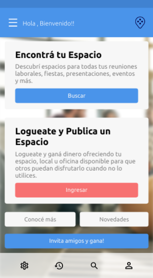
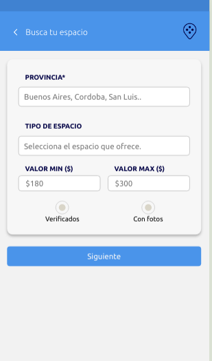
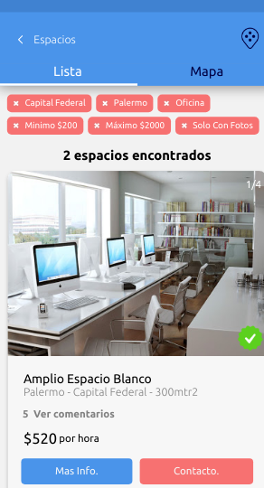
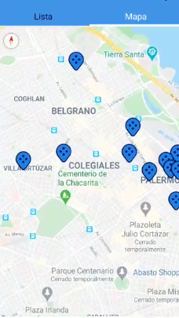
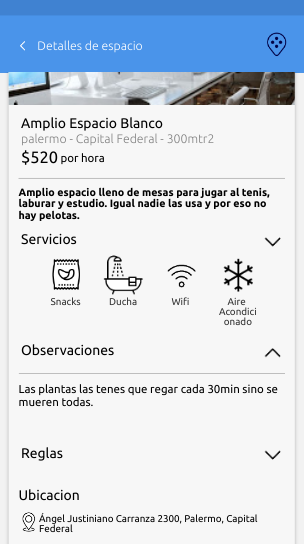
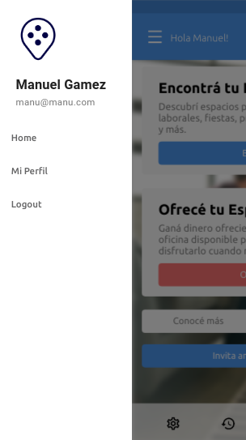
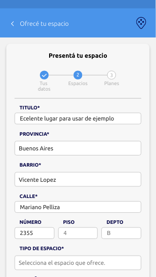
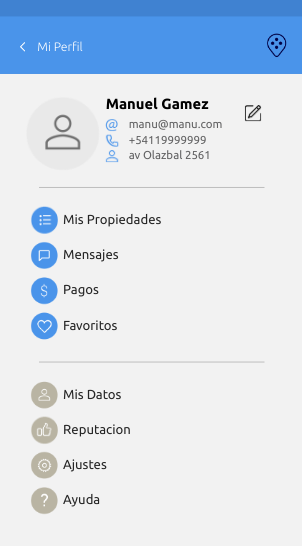

# Espacio por tiempo

 |  |  |
---------------------------------------------:|:---------------------------------------------:|:---------------------------------------------:|
Pantalla de inicio                            | Filtros de búsqueda                           | Lista de resultados                           |
---------------------------------------------:|:---------------------------------------------:|:---------------------------------------------:|

Espacio por tiempo es una aplicación desarrollada en React Native haciendo uso de la tecnología de Expo. Se trata de una app mobile y también de una Progressive Web Application para encontrar, publicar y contactar espacios para todo tipo de usos. Hace uso de la cámara para sacar fotos y de la API de Google Maps para poder visualizar los espacios por su ubicación en los mapas, entre otras cosas.

 |  |  |
---------------------------------------------:|:---------------------------------------------:|:---------------------------------------------:|
Mapa con los resultados                       | Vista de detalle del espacio                  | Inicio de sesión                              |
---------------------------------------------:|:---------------------------------------------:|:---------------------------------------------:|

Para el manejo de datos realizamos una Restful API con Express con una base de datos hecha con Firebase.

 |  |  |
---------------------------------------------:|:---------------------------------------------:|:---------------------------------------------:|
Menú lateral                                  | Formulario de publicar un espacio             | Perfil                                        |
---------------------------------------------:|:---------------------------------------------:|:---------------------------------------------:|

## Lista de Funcionalidades

- **Listar espacios** en una lista para visualizar los resultados de una búsqueda.
- **Filtrar** por categoría, locaciones, precio, si tiene fotos o si está verificado.
- **Paginación** para facilitar la navegación.
- **Carrusel** de imágenes para ver los espacios.
- **Datos geonormalizados** para igualar las formas de escribir provincias y localidades.
- **Mapas** para visualizar las ubicaciónes de los resultados de las búsquedas.
- **Vista de detalles** de cada espacio.
- **Contactar** cada espacio por teléfono o via email.
- **Registro** de usuarios.
- **Logueo** de usuarios.
- Funcionalidades de un usuario logueado
   - Añadir a **favoritos**
   - Listar **sus propiedades**
   - **Comentar** en otras propiedades
   - **Publicar** un espacio por medio de un formulario completo donde puede **sacar fotos** desde el mismo dispositivo
   - **Editar** sus propiedades

-----

## Inicialización

1. Copiar el proyecto

   Clona el proyecto en un directorio local con ejecutando en una terminal `git clone https://github.com/SantiDiLiscia/ext.git`. Luego accede a la carpeta del proyecto usando `cd ext`.

2. Obtener **Expo-cli**

   Ejecuta en la terminal `npm install -g expo-cli` para descargar la herramienta de expo de forma local en tu PC. Espera hasta que se instale el paquete antes de proceder.

3. Correr el servidor

   Ejecuta el commando `expo start` y luego de que este avise por medio de la terminal, ve al navegador y entre en `localost:19002`. Allí se debería poder ver la ventana de expo realizando los procesos. En el menú lateral se encontrará una lista de opciones de las cuales deberá clickear `run in web browser`. 

   En unos segundos aparecerá una nueva pestaña en el `localhost:19006` donde podrá visualizar el proyecto. Como desarrollo del mismo solo contempla el tamaño de pantalla de un celular, recomendamos ajustar el tamaño de la ventana para mejorar la experiencia.

4. Ejecutar en el celular

   Para esto deberá descargarse la aplicación de Expo y con esta scannear el código QR en la ventana de Expo en la PC. Esto puede tardar unos minutos en lo que construye eñ *bundle* y luego que el dispositivo lo descargue. Una vez hecho esto se debería poder visualizar el proyecto en el celular. 